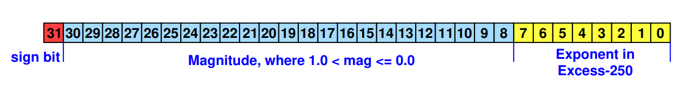

# Code organization 

```
PW2/
|  programs/
   |  fractal_myflpt/ - Floating point implementation
      |  src/ - flpt + mandlebrot implementation
      |  include/
         |  myflpt.h - interface to FP library
         |  cfg.h - configuration options: toggle various optimizations
      |  tb/ - FP testbench (discussed later)
   |  fractal_fxpt/ - Fixed point implementation
      | src/ - fxp + mandelbrot implementation
      | include/
          | fractal_conv.h - interface to FXP library
```

# Fixed Point Integers

## Format

In our fixed-point representation, we will use 32 bits to store the values.

From the theory behind the Mandelbrot algorithm, it is clear that the algorithm requires precise real numbers in order to function properly.

However, there are some restrictions on the range that we operate in. First of all, there is an escape condition for deciding if a coordinate is in the Mandelbrot set, namely:

$X_n^2 + Y_n^2 \geq 4$

Also, inside the coordinate system, we assume that we operate within the range:

$x = [-2, 1] \quad \text{and} \quad y = [-1.5, 1.5]$

as configured in the $\texttt{main\_fxpt.c}$ file. We can use this to derive a limit to the range of possible values.

First of all, we note that values can be negative, meaning we need a sign bit.

Next, we observe that the largest values that can be computed are the squares used in the escape condition. In the worst-case scenario, we have that, for instance, $X_n^2 + Y_n^2$ is close to $4$ but still below it. In the case they are equal, the next value of $Y_{n+1}$ will be $2 \cdot X_n \cdot Y_n$, which is almost equal to $8$. In the next escape condition, $Y_{n+1}^2$ results in a value just below $64$. After this, the escape condition stops computation and moves on to the next point. We consider this the worst-case incident, meaning we need 6 bits to represent values up to $64$, plus one more for the sign.

Considering this, we settled on the Q7.25 fixed-point format.

## Updated Code

We made all the fixed-point functionality in a file named $\texttt{fractal\_fxpt.c}$, with the corresponding header file:

```c
typedef int32_t fxp32_t;

fxp32_t floatToFXP(float in);
fxp32_t intToFXP(int in);
float fxpToFloat(fxp32_t in);

fxp32_t fxpAdd(fxp32_t op1, fxp32_t op2);
fxp32_t fxpSub(fxp32_t op1, fxp32_t op2);
fxp32_t fxpMul(fxp32_t op1, fxp32_t op2);
```

As shown, we define a new type $\texttt{fxp32\_t}$, which represents Q7.25 fixed-point values. Also shown are all the conversion and arithmetic functions.

By virtue of using fixed-point values, the arithmetic operations are rather simple. Only the $\textit{fxpMul}$ function has some particularities, arising from having to deal with overflow issues. This will be discussed further below.

In the $\texttt{fractal\_fxpt.h}$ and $\texttt{fractal\_fxpt.c}$ files, we changed the function definitions accordingly to allow the use of the fixed-point type.

```c
// Snippet from fractal_fxpt.h
typedef uint16_t (*calc_frac_point_p)(fxp32_t cx, fxp32_t cy, uint16_t n_max);

uint16_t calc_mandelbrot_point_soft(fxp32_t cx, fxp32_t cy, uint16_t n_max);

void draw_fractal(rgb565 *fbuf, int width, int height,
                  calc_frac_point_p cfp_p, iter_to_colour_p i2c_p,
                  fxp32_t cx_0, fxp32_t cy_0, fxp32_t delta, uint16_t n_max);
```

In $\texttt{src/main\_fxpt.c}$, we simply used the conversions to initialize the fixed-point values and called the $\textit{draw\_fractal}$ function with these values.

```c
fxp32_t CX_0_FXP = floatToFXP(CX_0);
fxp32_t CY_0_FXP = floatToFXP(CY_0);
fxp32_t DELTA_0_FXP = floatToFXP(delta);

draw_fractal(frameBuffer, SCREEN_WIDTH, SCREEN_HEIGHT,
  &calc_mandelbrot_point_soft, &iter_to_colour, 
  CX_0_FXP, CY_0_FXP, DELTA_0_FXP, N_MAX);
```

## Handling Overflow

As described above, the format should allow for all relevant values to be represented inside the Q7.25 fixed-point format. However, during multiplication, two 32-bit integers are multiplied, meaning we risk overflowing. There are three ways of handling this:

1. Casting to 64-bit values during multiplication and truncating afterward.
2. Truncating beforehand, followed by a 32-bit multiplication.
3. Not doing anything and hoping for the best.

We will not consider the third option. For the first option, the following approach can be used:

```c
// Casting to 64-bit in order to avoid overflow
fxp32_t fxpMul(fxp32_t op1, fxp32_t op2) {
  int64_t res = ((int64_t)op1) * ((int64_t)op2);
  return (fxp32_t)(res >> 25);  // Shifting back
}
```

Here, casting is used before doing 64-bit multiplication. Afterward, the value is right-shifted 25 bits since multiplication causes the fraction part of the fixed-point number to be shifted 25 bits left.

For the second option, truncating can be done first, in the following way:

```c
// Avoiding 64-bit multiplication
fxp32_t fxpMul(fxp32_t op1, fxp32_t op2) {
  int32_t res = ((int32_t)(op1 >> 13)) * ((int32_t)(op2 >> 13));
  return (fxp32_t)(res << 1);  // Shifting back
}
```

Here, we remove the lowest 13 bits, which loses some precision. However, 12 bits are still available for the fraction, which might be sufficiently accurate for our purposes. Afterward, the 32-bit values are multiplied. As before, multiplying the two 12-bit fraction parts left-shifts it by 12 bits. The result needs to be shifted once more to align the fraction part at the 25th bit correctly.

## Results

Running the program, a major improvement in speed is seen. With caches enabled, the floating-point implementation takes about 85 seconds. For the 64-bit multiplication version, it takes about 15 seconds. For the 32-bit multiplication version, it takes just about 5.64 seconds.

Without cache, it takes about 426 seconds for the 64-bit multiplication and about 166 seconds for the 32-bit multiplication. As mentioned during the lectures, floating point without cache takes more than 15 minutes. 

There is little loss of detail in the image between the different implementations, as shown in the figure below.

```{=latex}
\begin{minipage}{0.33\textwidth}
  \centering
  \includegraphics[width=0.9\textwidth,keepaspectratio]{imgs/flp_w_cache.png}\\
  Fig 1: FLP version
\end{minipage}%
\begin{minipage}{0.33\textwidth}
  \centering
  \includegraphics[width=0.9\textwidth,keepaspectratio]{imgs/fxp_64bit_mult_w_cache.png}\\
  Fig. 2: FXP 64-bit multiplication
\end{minipage}%
\begin{minipage}{0.33\textwidth}
  \centering
  \includegraphics[width=0.9\textwidth,keepaspectratio]{imgs/fxp_32bit_mult_w_cache.png}\\
  Fig. 3: FXP 32-bit multiplication
\end{minipage}
```

Based on this, we believe the 32-bit multiplication fixed-point version is the best, as it achieved an almost identical Mandelbrot while only taking about 5.6 seconds to complete.

# Floating Point Integers

## Format

We use the format given in the assignment, i.e. IEEE 754 with the mantissa and exponent flipped:



Using the same fields as IEEE 754 makes it easy to convert between float literals provided in C. Also, it enables easy verification of the operator implementations (since the hex can be compared directly). Since the underlying operations are on either 32-bit or 64-bit integers, the sizes don't make a big difference for performance. Thus, we also stick with the sizes given by IEEE 754 so we can achieve the same accuracy.

## Implementation

We provide implementations for the following functions:

 - FP add/subtract
 - FP multiply
 - FP divide
 - integer to float conversion

Comparison (e.g. the escape condition check in the Mandlebrot code) is implemented with a subtract followed by a check of the sign bit.

## Optimizations

Floating point addition and multiplication are implemented in the standard ways, as described in lecture. Code size can be saved by implementing subtraction as addition with the sign bit of the second operand flipped:

```c
#define fp_sub(a,b) (fp_add(a,(b^0x80000000)))
```

Division is handled the same as multiplication, only the mantissas are divided using integer division, and the exponents subtracted. Integer to floating point conversion is handled by extracting the sign bit, then counting the number of shifts needed to normalize the number that results into a mantissa, storing that in the exponent field. 

For multiplication, similar to the fix-point, we implement an optimization using 32-bit multiplications instead of 64-bit multiplications. Since IEEE 754 mantissas can be thought of as Q1.23 fixed point formats, we use the same trick of pre-shifting the operands and shifting the result back. This sacrifices relatively minimal accuracy because either way, the bottom bits are lost when truncating the result back to a Q1.23 format. We have

```c
#ifdef FP_MUL64
    int64_t mant_res_temp  = ((int64_t)(mant_a) * (int64_t)(mant_b)) >> MANT_BITS;
#else
    // Mantissas are Q1.23 fixed point values
    // We can do a 32-bit multiplication if we first convert them to 16-bit values,
    // to get a signed 32-bit result.
    // We have to make sure to shift one extra because we need to preserve the sign bit.
    // So the operands have the range of a 15-bit unsigned value.
    uint32_t mant_a_trunc = (mant_a >> ((MANT_BITS+1)-15));
    uint32_t mant_b_trunc = (mant_b >> ((MANT_BITS+1)-15));
    // First whole part (1) of fixed point in operand is at bit 14, should be at bit (MANT_BITS)
    // Make sure to convert to signed first because we want arithmetic shift!
    int32_t mant_res_temp = (int32_t)((mant_a_trunc * mant_b_trunc)) >> (14*2-MANT_BITS);
#endif
```

We employ an additional optimization in the mandlebrot code itself - the expression `2*x*y` is naively handled using two floating point multiplies. However, multiplication or division by a power of 2 in a floating point format is a simple addition with the exponent field. We have to be careful to handle the zero case though, since multiplication by 2 should still yield zero. There is also a concern of exponent overflow if the `x*y` is infinity (i.e. the exponent bits are `255`), but it does not cause problems for the mandlebrot workload. 

```c
#ifdef FRACTAL_2XOPT
    two_xy = -(xy != 0) & (xy + 1);
#else 
    // two is a constant defined to 2.0, converted to the myflp_t type
    two_xy = fp_mul(xy, two);
#endif
```

Finally, for modularity, we've extracted the renormalization loop, which handles shifting of the mantissa into the correct place and adjustment of the exponent accordingly, into its own function:

```c
static inline void renormalize(uint32_t *mant_res, uint32_t *exp);
```

It takes pointers to the unadjusted mantissa and the exponent and fixes both to be normalized. Add, multiply and divide then all share a call to this function. Code size is not saved by this since it's marked as inline, but on an I-cache bottlenecked system, we can consider making this a standard function call instead of being inlined.

## Testing

In addition to standard testing of the mandlebrot algorithm on hardware, we implemented a simple self-checking test bench which runs on the host machine, to verify our floating point implementations. This testbench can be ran using `make tb`, with the same Makefile that builds the firmware file for the board. The testbench runs the following testcases:

* 1 unit test for add, subtract, multiply, divide, and convert each
* Execution of the mandlebrot algorithm on one specific point, verifying that the number of disagreements between the floating point library and reference implementation is less than 1000
* Execution of the entire mandlebrot loop, drawing all points, displaying the number of pixels whose value (0 to 64) disagrees

According to this testbench, when using 64-bit integer multiplication in our float implementation, only 46 pixels disagree with the reference result. We suspect this is primarily due to not handling rounding of the mantissa the same way as the reference, since our result is often off-by-one in the LSB of the mantissa. It costs extra instructions for this check and does not appear to make a noticeable difference on the output image. We will see more of this in the results section below.
```
Total error pixels: 46 (out of 262144) (worst 13)
```
When using the 32-bit multiplication we proposed, we get an error of 1248 pixels:
```
Total error pixels: 1248 (out of 262144) (worst 39)
```
However, most of these are off by one, which does not hugely impact the image appearance. Filtering for only those greater than 2, it drops down to 408:
```
Total error pixels: 408 (out of 262144) (worst 39)
```

## Results 

First we will compare the accuracy of the image with the various optimizations proposed.

```{=latex}
\begin{minipage}{0.5\textwidth}
  \centering
  \includegraphics[width=0.9\textwidth,keepaspectratio]{imgs/flp_w_cache.png}\\
  Fig 4: Reference FLP
\end{minipage}%
\begin{minipage}{0.5\textwidth}
  \centering
  \includegraphics[width=0.9\textwidth,keepaspectratio]{imgs/myflp_64bit_mult_w_cache_no_x2.png}\\
  Fig. 5: Our FLP (64-bit mult)
\end{minipage}

\begin{minipage}{0.5\textwidth}
  \centering
  \includegraphics[width=0.9\textwidth,keepaspectratio]{imgs/myflp_32bit_mult_w_cache_no_x2.png}\\
  Fig. 6: Our FLP (32-bit mult)
\end{minipage}%
\begin{minipage}{0.5\textwidth}
  \centering
  \includegraphics[width=0.9\textwidth,keepaspectratio]{imgs/myflp_32bit_mult_w_cache_x2.png}\\
  Fig. 7: Our FLP (32-bit mult; faster mult by 2)
\end{minipage}
```

The differences are minimal between the various versions. The 32-bit has some minor artifacts which can be noticed, such as a bright green pixel in the dark green area towards the center at the bottom.

### Performance

We measured all performance figures with caches enabled.

| Reference FLP | Our FLP (64-bit mult) | Our FLP (32-bit mult) | Our FLP (32-bit mult; faster multiply by 2) |
| ------------- | --------------------- | --------------------- | ------------------------------------------- |
| 1m15s         | 58s                   | 47s                   | 42s                                         |

As the table shows, all implementations beat the reference implementation, while sacrificing minimal to no image quality. 32-bit multiplication and our efficient power of 2 multiplication method save further time.